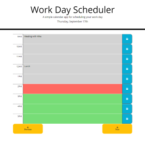

# 05-Day-Planner


day-planner is a simple web based planner that allows you to enter events by hour for any hour from 9 to 5. It is meant to be used for work-day scheduling and uses local storage to store the user entries persistantly. 

In addition to offering multi-day support, it uses dynamic styling to easily highlight the current hour. This styling will update even without a browser refresh through use of a setInterval function.

The date and time functionality of day-planner is built using the moment.js library. There are now more lightweight and in many cases [better libraries](https://momentjs.com/docs/#/-project-status/) for working with date and time, but the simplicity of Moment.js's API made it a good starting place to build this app. The mutability of Moment.js objects did initially cause a small problem when building this application, but the workaround ended up being very simple.

day-planner will eventually need to be updated to use server-side storage for the user inputed event descriptions. Since these are currently stored in localStorage, the user has no ability to access these event descriptions from different devices or even different browsers on the same device. I've also made the decision to allow the saved events to persist indefinitely, so that the user can refer back to past events if needed. While the individual event descriptions are very small, using day-planner for a sufficient amount of time would begin to store an unreasonable amount of data in localStorage.

day-planner is deployed at: https://elijah415hz.github.io/05-day-planner/

## Assignment from the client
### User Story

```
AS AN employee with a busy schedule
I WANT to add important events to a daily planner
SO THAT I can manage my time effectively
```

### Acceptance Criteria

```
GIVEN I am using a daily planner to create a schedule
WHEN I open the planner
THEN the current day is displayed at the top of the calendar
WHEN I scroll down
THEN I am presented with timeblocks for standard business hours
WHEN I view the timeblocks for that day
THEN each timeblock is color coded to indicate whether it is in the past, present, or future
WHEN I click into a timeblock
THEN I can enter an event
WHEN I click the save button for that timeblock
THEN the text for that event is saved in local storage
WHEN I refresh the page
THEN the saved events persist
```